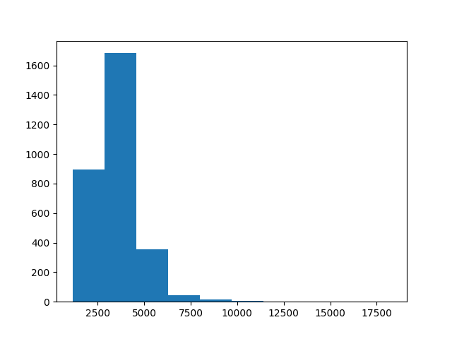
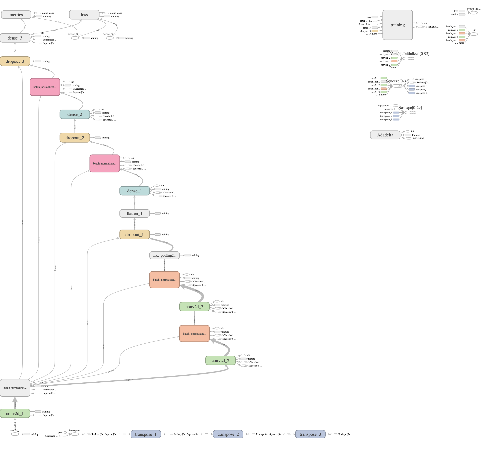
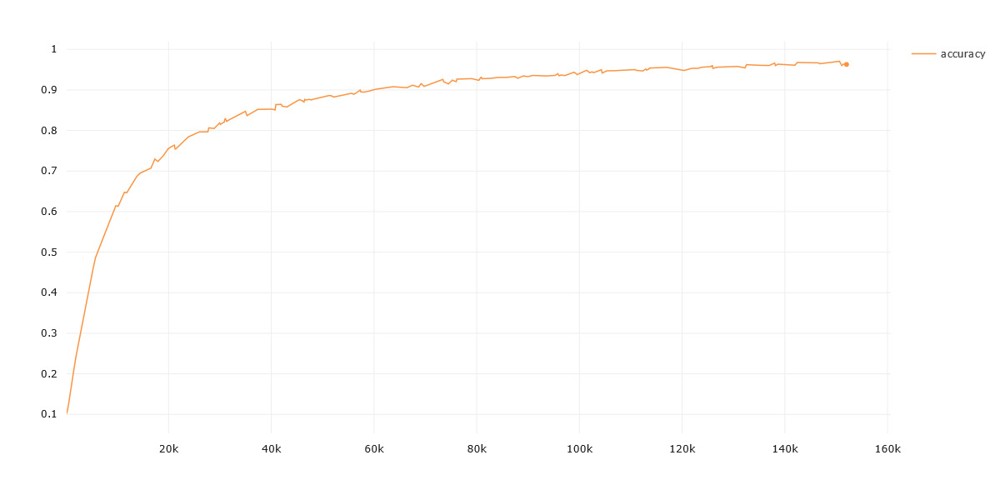
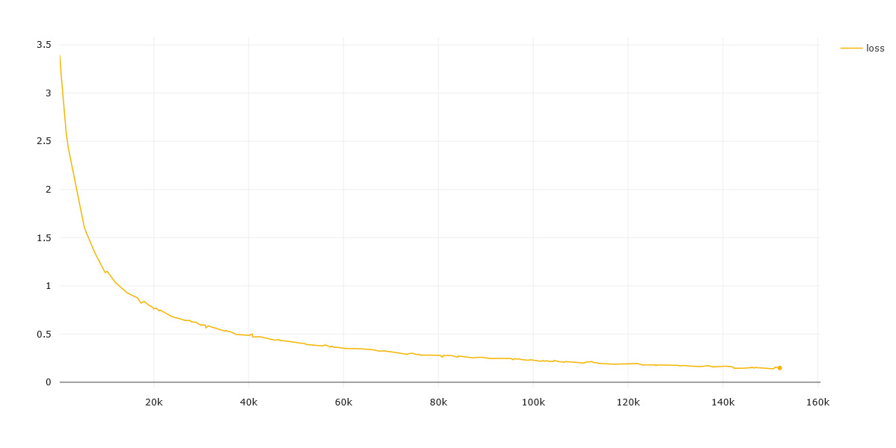

# Digit Recognition from Sound
#### A simple neural network (CNN) to classify spoken digits (0-9).

Original repo <a href='https://github.com/adhishthite/sound-mnist'>Sound-mnist @ adhishthite</a> doesn't seem to work anymore.
This implementation works with librosa 0.8.0 and Keras 2.4.3

---

# WORK IN PROGRESS.

Model seems to work, but wasn't much tested with new recordings. Additionally port to python_speech_features library is planned because embedded target supports c port of that library.

---

Dataset: <a href='https://github.com/Jakobovski/free-spoken-digit-dataset'>free-spoken-digit-dataset</a> (FSDD)

## Step 1 - Data Preprocessing

The data is provided as 50 audio samples (WAV files) of each digit per person, and 6 people have contributed to the official project.

Total data = 3000 audio samples in *.wav* format.

I've split the data as 90% train - 10% test.

Input data length histogram:

	 
	 
	<i>Histogram</i>

After looking through the data I've decided to set the sample length to 4096 samples, which requires padding on some recordings and cutting on the other. 

Training data was additionally augmented by adding some random noise or decreasing the amplitude of the signal.

Prepared data was further used to generate MFCC coefficients which are the input to the neural network.

### MFCC - Mel-Frequency Cepstrum Coefficient

* **Mel-Frequency Cepstrum Coefficient** 
	Here's what <a href='https://en.wikipedia.org/wiki/Mel-frequency_cepstrum'>Wikipedia</a> has to say about MFCC -  
	*In sound processing, the mel-frequency cepstrum (MFC) is a representation of the short-term power spectrum of a sound, based on a linear cosine transform of a log power spectrum on a nonlinear mel scale of frequency
	Mel-frequency cepstral coefficients (MFCCs) are coefficients that collectively make up an MFC. They are derived from a type of cepstral representation of the audio clip (a nonlinear "spectrum-of-a-spectrum"). The difference between the cepstrum and the mel-frequency cepstrum is that in the MFC, the frequency bands are equally spaced on the mel scale, which approximates the human auditory system's response more closely than the linearly-spaced frequency bands used in the normal cepstrum. This frequency warping can allow for better representation of sound, for example, in audio compression.*
	

## Step 2 - Model Building

We use **Keras** for the model building. 

* **Model Hyperparameters** 
	1. Optimizer - Adadelta 
	2. Number of epochs - 1000 
	3. Batch Size - default(32) 
	4. Learning rate - Adadelta default 
	5. Loss - Categorical Crossentropy 
	
* **Model Structure** 
	1. 3 convolutional layers
	2. 1 Max Pooling Layer
	3. 3 dense layers (MLP)
	4. Softmax Activation for output
	5. BatchNormalization Layer after every Conv Layer and Dense Layer.
	6. Dropout for every layer of MLP.
	

	 
	 
	<i>Tensorboard Visualisation of Model</i>

## Step 3 - Training

* **Accuracy** 

	 
	 
	<i>Model Accuracy</i>

* **Loss** 

	 
	 
	<i>Model Loss</i>

With that model about 96-97% validation accuracy is completely reachable.

## Step 4 - Test

Trained model reached 99% during test run .

10/10 [==============================] - 2s 19ms/step - loss: 0.0141 - accuracy: 0.9967

